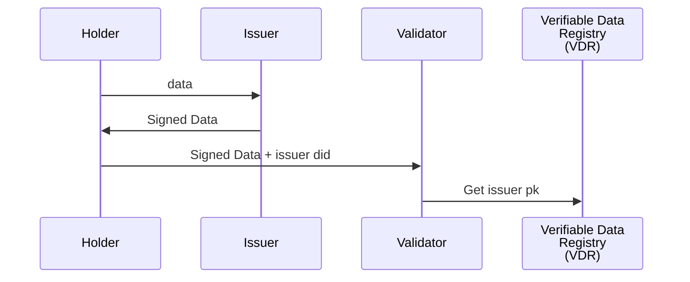

## Simple DID system in GO

### Sources:

- [Self Sovereign Digital Identity: How it works?](https://rudrapanda.medium.com/self-sovereign-digital-identity-how-it-works-96ea3f5aa014)
- [Decentralised Identifiers (DIDs)](https://rudrapanda.medium.com/decentralised-identifiers-dids-888b11875a50)
- [DIDComm Messaging v2.0](https://identity.foundation/didcomm-messaging/spec/v2.0/)
- [Verifiable Credentials Data Model v2.0](https://www.w3.org/TR/vc-data-model/#presentations)
- [Decentralized Identifiers (DIDs) v1.0](https://www.w3.org/TR/did-1.0/)

